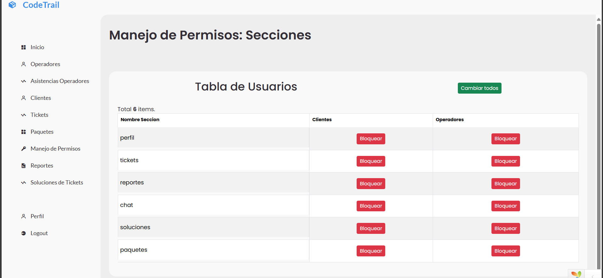
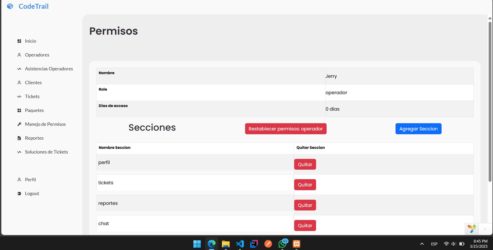
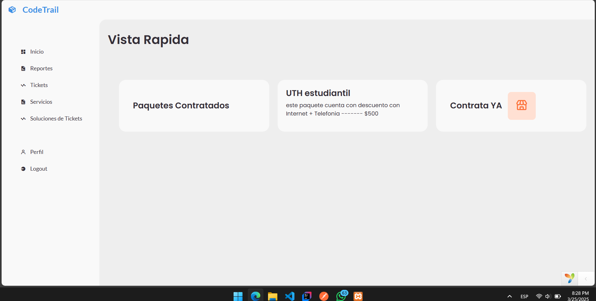
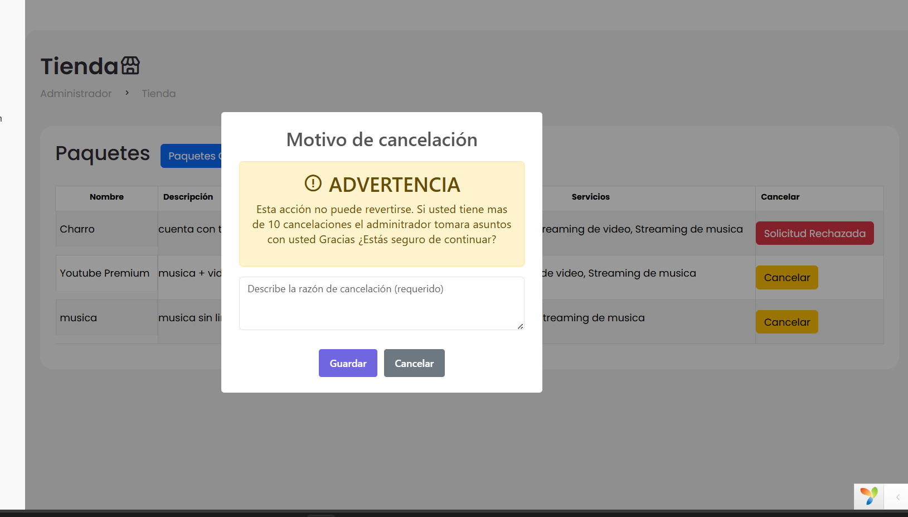
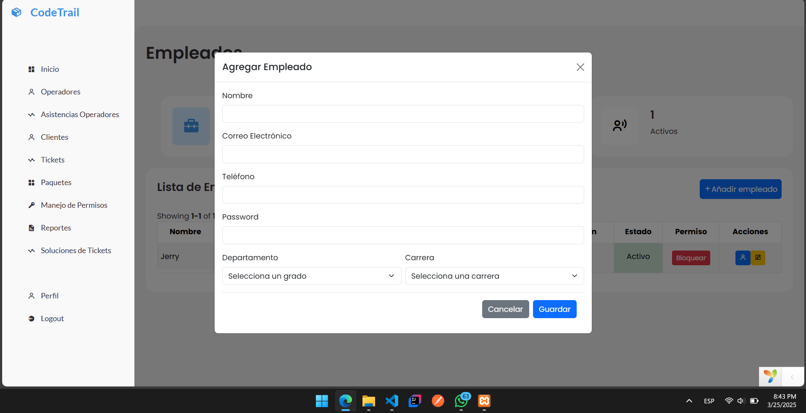

# 🎧 Sistema de Soporte al Cliente - Yii2 Framework

Sistema web desarrollado en **Yii2 PHP Framework**, **Bootstrap** y **JavaScript** para la gestión de tickets, usuarios y operadores en un entorno de atención al cliente.

> 🎯 Permite a los clientes generar tickets de soporte, a los operadores dar seguimiento, y a los administradores controlar, evaluar y gestionar el sistema.

---

## 📸 Vista previa

<!-- Puedes agregar más imágenes subiéndolas a la carpeta /docs y enlazándolas aquí. Por ejemplo: -->






     
 
---

## 🚀 Funcionalidades por Rol

### 👑 Administrador
- 👥 CRUD de usuarios y operadores
- 🔒 Bloquear y desbloquear cuentas
- 🧾 Gestión de logs del sistema
- 📈 Ver reportes y calificaciones
- 🧩 Gestión de secciones del sistema

### 🎧 Operador
- 📨 Visualizar tickets asignados
- 🚨 Atender quejas de clientes
- 📊 Ver su calificación
- 📦 Levantar paquetes y servicios

### 👤 Cliente
- 📝 Crear tickets
- 💬 Historial de chats
- ❌ Solicitar cancelación de servicios
- 🔐 Bloqueo/Desbloqueo
- 📃 Ver estado de sus servicios

---

## 🧱 Tecnologías utilizadas

| Lenguaje/Framework | Uso                              |
|--------------------|----------------------------------|
| PHP - Yii2         | Backend y estructura MVC         |
| Bootstrap          | Estilos responsive               |
| JavaScript         | Interactividad y validaciones    |
| MySQL              | Base de datos relacional         |
| HTML/CSS           | Diseño de vistas y formularios   |


---

## 🔐 Seguridad

- Gestión de roles: administrador, operador, cliente
- Control de acceso por permisos y rutas
- Validaciones en frontend y backend
- Mecanismo de bloqueo/desbloqueo de usuarios

---

## 📂 Estructura del proyecto

```bash
project/
├── assets/                  # Recursos como JS y CSS
├── commands/                # Comandos de consola Yii
├── config/                  # Configuraciones generales
├── controllers/             # Controladores MVC
├── models/                  # Modelos ORM
├── modules/                 # Módulos separados por roles
│   ├── admin/
│   ├── client/
│   └── operator/
├── runtime/                 # Archivos temporales
├── views/                   # Vistas del sistema
└── web/                     # Entrada pública del sistema
